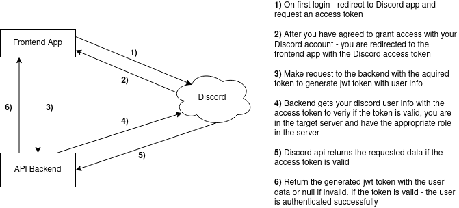
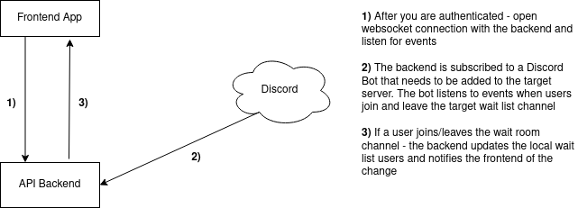

# Discord Waitlist Queue

## The problem

Discord sorts people in a channel by alphabetical order of the user name. 
If we have for example a wait list channel and we want to pull users one by one - we don't know the order or how long they have waited. 
The goal of this app is to simplify this process as we can have visibility of the order in the wait list channel, how long the user has waited and we also can move users to target channels.  
Maybe in the future there can by added functionality for people to apply for waiting list and in order to do so - they need to enter some additional info or answer questions. This info then can be viewed from the people that manage the wait list.

## Features

- Login with discord. This app doesn't store any of your credentials
- Check if you are in the configured server and you have the target permission role - otherwise you won't be able to login
- When logged in
    - Browse see who's in `waiting room channel`
    - You can move people from `waiting room channel` to one of the configured `interview room channels`
- Waiting room
    - People in wait room channel are synced in realtime with the server wait room when they join or leave. The changes are applied both ways - when you move people from discord and/or when you move people from this app
    - Show the order of the people (by joined time) in the waiting room
    - Show for how long the people are waiting (updated every 1 minute)

## How it works?

Create a Discord App and a Bot, add the Bot to your server, configure and run the `frontend` and `backend` apps - done.

### Authentication workflow

### App workflow

## Demo

In the demo bellow is demonstrated the following:
- login in the app (right side of the screen)
- login with Discord on initial login
- open discord from 2 accounts (left side of the screen)
- move users from Discord and the app
- demonstrates realtime changes

More info:
- `Wait list` is the channel that people wait in
- `public-toilet` and `crimminals` are the interview channels that the interview is made in

## Discord setup needed

- Create an App from the discord [developer portal](https://discord.com/developers/applications)
- Under OAuth2 section -> General -> Redirects -> add the domain of the frontend app
- Again while in the app - create a Bot
    - Check `PRESENCE INTENT` and `SERVER MEMBERS INTENT` under Privileged Gateway Intents
- Add the Bot to your server and give a permissions to move users form one channel to another. Can usually be done by giving it some existing discord server role

## Setup App

### Setup frontend app

Check the README of the `frontend` app folder

### Setup backend app

Check the README of the `backend` app folder
